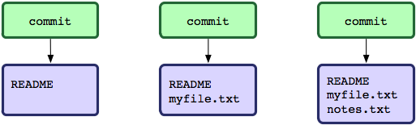

---
title: "Introdução ao *Git*"
author: Pedro Vasconcelos, DCC/FCUP
date: Abril 2017
...

# Controlo de Versões

## Controlo de Versões

Sistemas de controlo de versões (VCS) são ferramentas para:

* arquivar ficheiros de um projeto (código-fonte e outros)
* registar alterações durante o desenvolvimento
* desfazer alterações ou recuperar versões anteriores
* sincronizar  diferentes computadores
* colaborar com programadores (locais ou à distância)
* separar "troncos" de desenvolvimento (e.g.\ produção/desenvolvimento)


## Sistemas Locais

Os primeiros *VCS* registavam modificações de ficheiros apenas numa
base de dados local.

\

Exemplos: *SCCS*, *RCS*.

## Sistemas Locais (2)

<p align="center">

</p>


## Sistemas Locais (3)

Permitem:

* registar e desfazer edições;
* recuperar versões anteriores.

Não permitem:

* sincronização entre computadores;
* colaboração entre programadores.


## Sistemas Centralizados

Os *sistemas centralizados* registam alterações numa base de dados
central; todos os clientes utilizam a mesma base de dados.

\

Exemplos: *CVS*, *SVN*

## Sistemas Centralizados (2)

<p align="center">

</p>


## Sistemas Centralizados (3)

Vantagens sobre os sistemas locais:

* sincronização entre computadores
* colaboração entre programadores

Limitações:

* não permitem trabalhar *off-line*
  (é necessário acesso ao servidor para registar alterações)
* o servidor constitui um *ponto crítico de falha*


## Sistemas Distribuídos

Nos sistemas distribuidos cada cópia do repositório mantém 
também a *base de dados de modificações*.

\

Exemplos: *GNU arch*, *Darcs*, *Mercurial*, *Git*.


## Sistemas Distribuídos (2)

<p align="center">

</p>


## Sistemas Distribuidos (3)

Vantagens sobre sistemas centralizados:

* todas as cópias do repositório contêm a historia completa
* permitem registar alterações mesmo sem acesso a rede
* não há um ponto crítico de falha: qualquer cópia
  do repositório contém a história completa
* facilitam a introdução de mudanças experimentais
  separadas das estáveis ("*branching*")

Desvantagens:

* necessitam de mais espaço em disco 
* a utilização pode ser mais complexa do que os sistemas tradicionais


# Git

## O que é o *Git*?

* Um sistema de controlo de versões distribuído desenvolvido desde 2005
* Concebido para gestão do código do *kernel* Linux
* Muito usado em projetos *open-source*
* Características:
	* conceção simples mas poderosa
	* adequado a projectos grandes, com
	  muitos ficheiros e com história longa
	* eficiente em espaço e recursos computacionais
	* suporte para desenvolvimento não-linear ("*branching*")
	* completamente distribuído


## O *Git* dá-te super-poderes!

Utilizar *Git* é um método de trabalho valioso:

* Garantimos a **integridade** dos ficheiros \
  (diga adeus às *pen-drives* para transportar ficheiros entre
  casa e trabalho)
* Usando um repositório remoto, **temos sempre um *backup*** caso algo
  corra mal
* Permite **experimentar e explorar** sem termos medo das
  consequências (dá sempre para voltar atrás caso seja
  necessário)
* As mensagens de *commits* permitem-nos rever os **motivos das alterações**


## Como funciona

* Cada repositório mantém um conjunto de ficheiros e diretórios (um
  mini-sistema de ficheiros)
* Podem mudar ao longo do tempo:
    - acrescentar/remover ficheiros
	- editar o conteúdo
* Quando o utilizador regista uma modificação (*commit*):
     - guarda o estado atual de *todos* os ficheiros marcados (*snapshot*)
	 - para os ficheiros não modificados:
	   guarda apenas uma referência para o estado anterior
* Um repositório *Git* é uma sequência destes "*snapshots*"


## Fluxo de trabalho básico

Três fases:

1.  **Modify**: modificar os ficheiros no directório de trabalho.
2.  **Stage**: adicionar *snapshots* dos ficheiros à "área de estágio"
    (*staging area*).
3.  **Commit**: registar esse *snapshots* na base de dados do *Git*
    juntamente com uma *mensagem* de arquivo.


## Operações básicas

<p align="center">

</p>

## *Commit*

* Uma "imagem" dos ficheiros tal como estavam quando estagiados
* Uma **mensagem de arquivo** que descreve a alteração efetuada
* Meta-informação do autor e data

<p align="center">

</p>

Qualquer *commit* pode ser inspecionado e recuperado se assim
quisermos.


## Ciclo de Vida

Os ficheiros no directório de trabalho podem estar em quatro estados
diferentes em relação ao *commit* atual.

<p align="center">

</p>


<!--
# Git Básico - Repositórios remotos

Os comandos básicos para trabalhar com repositório remoto são

-   *clone*: “clonar” um repositório remoto (faz uma cópia local
    completa).
-   *pull*: obter alterações de um repositório remoto.
-   *push*: enviar alterações para um repositório remoto.

Vamos ver alguns exemplos.


# Git Básico - Vantagens

Vantagens de usar Git:

-   Quase todas as operações são locais.
-   “*Snapshots*” registados (*committed*) são sempre mantidos.
-   Forte suporte para desenvolvimento não-linear.

-->


# Utilização do *Git* 

## Configuração inicial 

Antes de usar *Git* pela primeira vez:

#### Escolher a sua identidade

```bash
git config --global user.name "John Doe"
git config --global user.email john@doe.com
```


#### Mais configurações (opcionais)

```bash
git config --list
```

#### Obter ajuda

```bash
git help 
```


## Inicializar um repositório local

```bash
mkdir my_repo
cd my_repo
git init
```

* inicializa um diretório `my_repo/.git`
  que vai conter a base de dados do repositório
* o repositório começa *vazio*: temos de
  adicionar ficheiros e/ou diretórios

## Adicionar ficheiros

```bash
git add ficheiro1
git add ficheiro2 
```

\

Podemos também adicionar vários ficheiros de uma só vez:

```bash
git add ficheiro1 ficheiro2 
```

\

Os ficheiros ficam na *área de estágio* --- temos de fazer um
*commit* para os registar na base de dados do *Git*.

## Primeiro *Commit*

```bash
git commit -m "Iniciar o meu repositório"
```

\

Podemos também adicionar ou remover ficheiros mais tarde.

##  Modificar ficheiros

Depois de fazer alterações aos ficheiros na área de trabalho
(e.g. usando um editor de texto):

1. adicionar novamente os ficheiros à àrea de estágio
2. registar um *commit* com uma mensagem descritiva.

```bash
emacs    # editar ficheiros 
...
git add ficheiro1 ficheiro2
git commit -m <mensagem>
```

## Consultar o estado


```bash
git status
  # ver estado da área de trabalho e de estágio
```

`Changes to be commited`

:     ficheiros modificados **que vão ser incluidos** no próximo *commit*

`Changes not staged for commit`

:     ficheiros modificados mas **não incluidos** no próximo *commit*

`Untracked files`

:     ficheiros na área de trabalho que o *Git* não está a gerir


## Outras consultas


```bash
git diff
 # listar modificações desde o último *commit*
```

```bash
git log
  # Listar o histórico de *commits*
```
\

Estes comandos aceitam muitas opções extra; ver ajuda
no manual:

~~~bash
git diff --help
git log --help
~~~


# Sincronização e colaboração

## Repositórios remotos

Em *Git* todos os repositórios têm a mesma estrutura
e suportam os mesmos comandos.

\

Um *repositório remoto* é apenas
um diretório *Git* que está localizado noutro computador.


## Usar um repositório remoto

Para copiar um repositório remoto já inicializado
basta fazer *clone*:

```bash
git clone URL-do-repositório-remoto
```

* O URL de um servidor remoto é tipicamente
  `https://...`  ou `ssh://...`
* Obtemos uma cópia local completa do repositório que podemos 
  consultar e modificar livremente


## Usar um repositório remoto (cont.)

Podemos fazer alterações à copia local dos ficheiros
tal como anteriormente.


```bash
  # editar ficheiros localmente
...
git add ficheiro1
git add ficheiro2
...
git commit -m "mensagem descritiva..."
```

Após este comando, esta modificação foi
registada **apenas no repositório local**
--- ainda nada foi enviado ao servidor remoto!


## Enviar modificações 

Para enviar os seus *commits* locais
para o repositório remoto usamos o comando *push*.

```bash
git push
```

## Receber modificações

Para receber alterações que outros tenham enviado ao repositório remoto
usamos *pull*:

```bash
git pull
```

Este comando descarrega *commits* no repositório remoto feitos desde a
última vez aplica-os ao repositório local.


## Como coordenar com colaboradores

Há várias formas de usar *Git* com repositórios remotos:

* com um *branch* único partilhado por todos os colaboradores ---
  semelhante ao uso num sistema centralizado
* com *branches* distintos para desenvolvimento separado


## Nesta unidade curricular

Sugerimos usar o *Git* de forma centralizada:

* com um repositório central num servidor *Gitlab*;
* serve como o *ponto de sincronismo* entre os colaboradores;
* com um único *branch* de desenvolvimento (*master*).


## Repositório central

* Servidor *Gitlab*: \
  [https://gitlab01.alunos.dcc.fc.up.pt](https://gitlab01.alunos.dcc.fc.up.pt).
* Interface *web* para projetos em *Git*
* Semelhante ao *Github* mas mantido num servidor do DCC
* Cada aluno tem uma conta pessoal (*login/password* do LabCC)
* *Grupos* de dois alunos para os trabalhos --- criados durante as aulas 


## Conflitos

Se um dos nossos *commits* modificar parte dum ficheiro
que outro colaborador também editou,
o *Git* vai sinalizar um **conflito**.

\

O *Git* **não resolve o conflito sozinho**; o utilizador
deve:

1. editar o(s) ficheiro(s) afetado(s)
   e juntar as modificações
2. registar um novo *commit* de resolução
3. enviar a resolução para o repositório remoto

## Exemplo

~~~bash
git pull
# CONFLICT (content): Merge conflict in file.txt
~~~


~~~
<<<<<<< HEAD:file.txt
Hello world
=======
Goodbye
>>>>>>> 77976da35a11db4... :file.txt
~~~~

\

Entre `<<<<<<` e  `=====` é a **modificação local**.

Entre `======` e `>>>>>>`  é a **modificação remota**.

## Resolver o conflito

Editamos `file.txt` e juntamos as modificações:

~~~
Hello world
Goodbye
~~~

\

Registamos um novo *commit* de resolução:

~~~bash
git add file.txt
git commit -m "resolver conflito"
~~~

## Resolver o conflito (cont.)

Por fim, fazemos o `push` da resolução
para o repositório remoto.

~~~bash
git push
~~~


## Sumário


`clone`

:    copiar um repositório remoto

`add`

:    adicionar ficheiros alterados à àrea de estágio


`commit`

:     registar alterações no repositório local

`push`

:     enviar alterações ao repositório remoto

`pull`

:     pedir alterações do repositório remoto


# Recomendações

## Alguns cuidados a ter

* Fazer bons *commits*:
    - use o *git add* para juntar apenas as alterações relacionadas 
    - escolha *boas mensagens*: o **porquê** do commit,
	  não a quais os ficheiros (desnecessário!) 
	
* Ter em atenção que, se alterarmos a história do repositório de forma
  descuidada, não estamos apenas a afectar-nos mas também aos nossos
  colegas de trabalho.

## Exemplos de más mensagens

~~~bash
git commit -m "Últimas alterações."
git commit -m "Alterações do Pedro."
git commit -m "Adiciona o Jogador.java."
git commit -m "Alterações no Jogador.java."
git commit -m "Adiciona cenas."
git commit -m "Revision"
git commit -m "Blablabla"
git commit -m "WTFWTFWTF"
~~~

## Exemplos de boas mensagens


~~~bash
git commit -m "Resolve o bug do prémio"
git commit -m "Remove duplicação de código"
git commit -m "Acrescenta contagem de pontuação"
~~~

# Extras

## Mudar nomes

P: Como fazer para mudar o nome de um ficheiro
ou diretório que foi registado no *Git*?

\

R: Usamos `git mv` para mudar o nome de um
ficheiro preservando a história de alterações.

```bash
git mv nome-atual nome-novo
```

## Desfazer modificações

P: Editei um ficheiro na área de trabalho,
mas agora quero desfazer essas alterações.

\ 

R: Usamos `git checkout` para reverter modificações de volta
para o estado registado no último  *commit*:


~~~bash
git checkout -- nome-do-ficheiro
~~~

## Desfazer *stagging*

P: Adicionei um ficheiro à área de estágio, mas
afinal não quero incluí-lo no próximo  *commit*.

\

R: Usamos `git reset HEAD` para remover um ficheiro da área de estágio:

~~~bash
git reset HEAD nome-do-ficheiro
~~~


## Referências

* [Git Community Book](http://git-scm.com/book/en/v2)
* [Pro Git](http://progit.org/)
* [Git Reference](http://gitref.org/)
* [Github](http://github.com/)
* [Atlassian git tutorial](https://www.atlassian.com/git/tutorials/)
* [Git immersion](http://gitimmersion.com/)


## GUIs para *Git*

* [Sourcetree](http://www.sourcetreeapp.com) (MacOS, Windows)
* [Giggle](http://live.gnome.org/giggle) (Linux)


## 

<p align="center">
\
</p>
