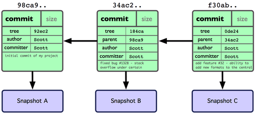

---
title: Introdução ao *Git*
author: Pedro Vasconcelos, DCC/FCUP
date: setembro 2020
...

# Introdução ao *Git*

## Esta apresentação

* Introdução ao uso do sistema de controlo de versões *Git*
* Direcionado para estudantes de primeiros anos
* Vamos usar:
	- sistema operativo GNU/Linux ou MacOs
    - editor de texto, *shell*, *browser web*

Slides:

~~~bash
$ git clone https://github.com/pbv/gitprimer
~~~

# Conceitos

## Sistemas de Controlo de Versões (VCS)

Ferramentas para:

* arquivar ficheiros de um projeto (código-fonte e outros)
* registar alterações durante o desenvolvimento
* desfazer alterações ou recuperar versões anteriores
* sincronizar diferentes computadores
* colaborar com outros programadores
* separar "troncos" de desenvolvimento \
  (ex: produção/desenvolvimento)

<!-- 

## Sistemas locais

* Os primeiros *VCS* 
* Registavam modificações numa base de dados local
* Exemplos: *SCCS*, *RCS*.

<p align="center">

</p>


## Sistemas locais (2)

Permitem:

* registar e desfazer edições;
* recuperar versões anteriores.

Não permitem:

* sincronização entre computadores;
* colaboração entre programadores.


## Sistemas centralizados

* Registam alterações numa base de dados central.
* Exemplos: *CVS*, *SVN*

<p align="center">

</p>


## Sistemas centralizados (2)

Vantagens sobre os sistemas locais:

* sincronização entre computadores
* colaboração entre programadores

Limitações:

* não permitem trabalhar *off-line*
  (é necessário acesso ao servidor para registar alterações)
* o servidor constitui um *ponto crítico de falha*

-->

## VCS distribuídos

<p align="center">

</p>


## VCS distribuidos (2)

Vantagens:

* Cada cópia do repositório contém a historia completa
* Permitem registar modificações mesmo sem acesso a rede
* Evitam um ponto crítico para falhas
* Facilitam a introdução de *branches* experimentais

Desvantagens:

* Necessitam de mais espaço em disco 
* A sua utilização pode ser um pouco mais complexa


# 

## 

* Um VCS distribuído 
* Desenvolvido desde 2005 para o código do *kernel* Linux
* Muito usado em projetos *open-source*
* Características:
	* conceção simples mas poderosa
	* adequado a projectos grandes (muitos ficheiros e história longa)
	* eficiente em espaço e recursos computacionais
	* suporte para desenvolvimento não-linear ("*branching*")


## Porquê usar *Git*?

* Sincronização de trabalhos entre computador pessoal e da universidade 
    - diga adeus às *pen drives* ou *Dropbox*
* Permite experimentar modificações sem receios
    - podemos reverter facilmente se necessário
* Repositórios remotos funcionam como *backup* 
* As mensagens de *commits* são um registo histórico do
  desenvolvimento
* Não apenas para código: documentação, relatórios, dissertações


## Como funciona

* Cada repositório consiste
  de um conjunto de ficheiros e sub-diretórios
* Quando registamos uma modificação (*commit*), o *Git* guarda um
  *snapshot* de todos os ficheiros
* Ficheiros inalterados são guardados como *referências* ao *commit*
  anterior

<p align="center">
  
</p>


## Integridade 

* O *Git* associa um *hash* (40 carateres hexadecimais) a cada
  *snapshot*, e.g.:

~~~
  34ac2a6552252987aa493b52f8696cd6d3b00373
~~~

* Garante que o conteúdo dos ficheiros não foi corrompido
* Serve também para identificar cada *snapshot* 

<p align="center">

</p>


## Repositórios locais e remotos

* Quase todas as operações com *Git* são **locais**:
    - inicializar repositórios
    - acrescentar/remover ficheiros
    - registar modificações (*commit*)
    - listar a história
* Mas o *Git* permite também *sincronizar*
  com repositórios remotos
* Um repositório remoto é apenas um diretório *Git* 
  noutro computador na rede!


## *Hosting* de repositórios

GitHub

:      [https://github.com/](https://github.com/)

GitLab

:      [https://gitlab.com/](https://gitlab.com/)

\

Necessitam de registo, mas permitem criar contas gratuitas.


# Utilização 

## Comando `git`

Utilizamos o comando `git` para as várias operações:

> `git` operação arg1 arg2 ...

Exemplo:

~~~bash
$ git log --oneline
$ git help
~~~


## Configuração inicial 

~~~bash
$ git config --global user.name "My name"
$ git config --global user.email my@email.domain
~~~

\

Listar as configurações:

```bash
$ git config --list
```


## Criar um novo repositório 

```bash
$ mkdir my-project
$ cd my-project
$ git init
```

* Cria um diretório `my-project/.git` para meta-dados 
* O repositório está inicialmente *vazio*
* Devemos depois adicionar ficheiros e/ou sub-diretórios


## Adicionar ficheiros

~~~bash
# editar os ficheiros...
$ git add src/foo.c
$ git add src/bar.h
$ git add README.txt
~~~

* Podemos adicionar vários ficheiros de uma só vez:

~~~bash
$ git add src/foo.c src/bar.h README.txt
~~~

* Os ficheiros ficam na *área de estágio*
* Temos de fazer um *commit* para os registar no *Git*

## Primeiro *commit*

```bash
$ git commit -m "initialized repository"
```

* Todos os commit têm uma *mensagem* textual associada
* Se omitir a opção `-m` o *Git* abre um editor de texto 
  para compor a mensagem


##  Modificar ou acrescentar

Depois de modificar algum(s) dos ficheiros 
(e.g.\ usando um editor de texto) devemos:

1. adicionar os ficheiros modificados à àrea de estágio
2. registar um *commit* com uma mensagem descritiva.

~~~bash
#  editar / criar ficheiros ...
$ git add README.txt LICENSE.txt
$ git commit -m "modified and created files"
~~~

## Modificar ou acrescentar (2)

Podemos optar por registar as modificações
como dois *commits* separados:

~~~bash
$ git add README.txt 
$ git commit -m "modified file"
$ git add LICENSE.txt
$ git commit -m "created file"
~~~


## Estados de um ficheiro

------------  -----------------------------------------------------
*Committed*    guardados na base de dados local 
*Modified*     modificados em relação à versão guardada
*Staged*       marcados para entrar no próximo *commit*
------------  ------------------------------------------------------

\

<p align="center">

</p>


## Consultar o estado do repositório


~~~bash
$ git status
~~~

`Changes to be commited`

:     modificações **que serão incluidas** no próximo *commit*

`Changes not staged for commit`

:     ficheiros modificados mas ainda **não incluidos** no próximo *commit*

`Untracked files`

:     ficheiros na área de trabalho que o *Git* não está a gerir


## Outras consultas


```bash
$ git diff  # listar modificações 
$ git log   # listar o histórico de commits
```

### Exemplos 

~~~bash
$ git diff 
$ git diff src/foo.c
$ git log --oneline
$ git log --since=01/04/2017 --author="Pedro"
~~~

(Use `--help` para obter ajuda completa.)

## *Checkout*


O *Git* permite "viajar no tempo" de desenvolvimento do
projeto.


Usando `git checkout` podemos reverter o diretório de trabalho para
*snapshots* específicos.


## Exemplo

Listar todos os *snapshots* (mais recente primeiro):

~~~bash
$ git log --all --oneline
7fd2d99 third commit
7cf2ce7 second commit
432bffa first commit

# reverter ao 1º commit
$ git checkout 432bffa

# avançar até ao último commit 
$ git checkout master
~~~


# Sincronização e colaboração

## Repositórios remotos

Em *Git* todos os repositórios têm a mesma estrutura
e suportam os mesmos comandos.


Um repositório remoto é apenas
um diretório *Git* noutro computador!


## Copiar um repositório remoto

Se o repositório remoto já foi inicializado:

~~~bash
$ git clone <url-remoto>
~~~

* Accesso por HTTPS ou SSH
* Obtemos uma cópia completa podemos editar livremente
* Cria num novo diretório com uma **cópia local** do repositório


<!--
## Associar um repositório remoto

Se o repositório local já foi inicializado:

~~~bash
cd my-project
git remote add origin <url-remoto>
git push -u origin master
~~~
-->

## Modificar

Registamos alterações no repositório local
(tal como anteriormente).


~~~bash
# editar README src/foo.c
$ git add README src/foo.c
$ git commit 
~~~

O *commit* é local &mdash;
nada foi ainda enviado para o repositório remoto.


## Enviar modificações 

Usamos o comando *push* para sincronizar *commits* locais
para o repositório remoto.

~~~bash
$ git push
~~~

## Receber modificações

Usamos *pull* para receber *commits* do repositório remoto:

~~~bash
$ git pull
~~~

Este comando descarrega os *commits* remotos que ainda não 
não existem no repositório local. 


## Coordenar com colaboradores

* Crie um repositório num servidor *GitHub/GitLab*
* Esse repositório será usado como *ponto de sincronização* entre os colaboradores
* Começe usando apenas um *branch* de desenvolvimento (por omissão: *master*)
* Quando estiver mais experiência, pode introduzir *branches*
  distintos para desenvolvimento separado


## *Merging*


* Juntar desenvolvimento divergente: operação
  de *merge*
* O *merge* introduz num novo *snapshot* que unifica
  os ramos divergentes
* O *Git* tenta fazer *merge* automático sempre que executamos
  `push` ou `pull`
* Em caso de **conflitos**: o merge automático falha


## Conflitos

Se dois *commits* separados modificarem 
um mesmo ficheiro o *Git* pode sinalizar um **conflito**.

O conflito é detetado quando tentarmos sincronizar com
um repositório remoto (`pull` ou `push`).

## Resolver conflitos

1. Editar os ficheiros afetados e juntar as alterações
2. Registar um novo *commit* de resolução
3. Efetuar `push` para o repositório remoto


## Exemplo

~~~bash
$ git pull
# CONFLICT (content): Merge conflict in file.txt
~~~


~~~
<<<<<<< HEAD:file.txt
Hello world
=======
Goodbye
>>>>>>> 77976da35a11db4... :file.txt
~~~~

\

Entre `<<<<<<` e  `=====` é a **modificação local**.

Entre `======` e `>>>>>>`  é a **modificação remota**.

## Resolver o conflito (1)

Editamos `file.txt` e juntamos as modificações:

~~~
Hello world
Goodbye
~~~

## Resolver o conflito (2)

Registamos um  *commit* de resolução:

~~~bash
$ git add file.txt
$ git commit -m "resolução de conflito"
~~~

## Resolver o conflito (3)

Por fim, fazemos o `push` da resolução
para o repositório remoto.

~~~bash
$ git push
~~~


# Recomendações

## Escolher *commits*

* Use `git add` para juntar alterações relacionadas 
* Tente compor boas mensagens:
    - não dizer quais os ficheiros alterados
    - explicar o **sentido** das alterações

## Exemplos 

### OK

~~~
$ git commit -m "revisão de foo.c"
$ git commit -m "últimas alterações"
$ git commit -m "alterações do Pedro"
~~~

### Melhor

~~~
$ git commit -m "resolve o bug #1234"
$ git commit -m "remove duplicação de código"
$ git commit -m "geração de código para ciclos"
~~~

# Extras

## Mudar nomes

Como fazer para mudar o nome de um ficheiro
ou diretório?

### Solução

~~~bash
$ git mv <nome-atual> <nome-novo>
~~~

## Desfazer modificações

Editei um ficheiro na área de trabalho,
mas agora quero desfazer essas alterações.

### Solução

~~~bash
$ git checkout -- <ficheiro>
~~~

(Reverte modificações para o estado registado no último  *commit*.)


## Desfazer *stagging*

Adicionei um ficheiro à área de estágio, mas
afinal não quero incluí-lo no próximo  *commit*.

### Solução

~~~bash
$ git reset HEAD <ficheiro>
~~~

## Sumário 

------------  -------------------------------------------
`init`                         inicializar um repositório
`clone`        copiar um repositório remoto
`add`          adicionar ficheiros à àrea de estágio
`commit`       registar alterações no repositório local
`checkout`     reverter para um *snapshot* específico
`push`         enviar alterações ao repositório remoto
`pull`         puxar alterações do repositório remoto
------------   --------------------------------------------


## Mais informação

* [Git Community Book](http://git-scm.com/book/en/v2)
* [Git Reference](http://gitref.org/)
* [Atlassian git tutorial](https://www.atlassian.com/git/tutorials/)
* [Git immersion](http://gitimmersion.com/)

## Em caso de desespero ;-)
 
<p align="center">

</p>


###  [https://xkcd.com/1597/](https://xkcd.com/1597/)
